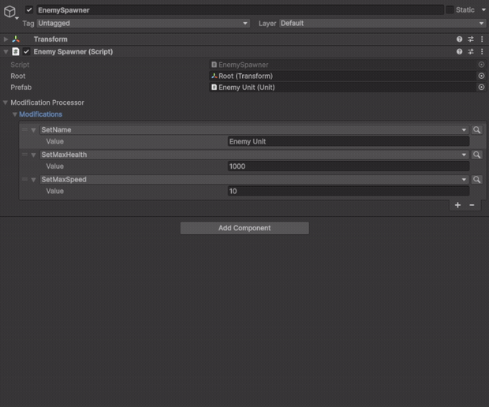
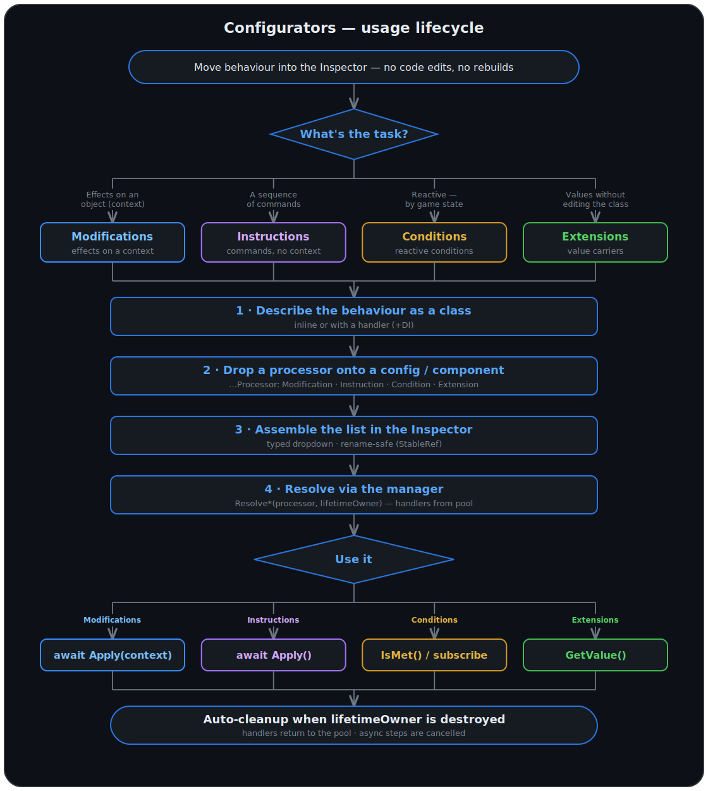

[](../../releases)
[](../../releases)
[](../../commits)
[](LICENSE.md)

**English** | [Русский](README.ru.md)

---

**Gameplay rules as data.** Describe a behaviour once as a small serializable class — then assemble, reorder, and combine those behaviours as a list right in the Inspector, with no code changes.

In the Inspector you only assemble ready-made components and configure them. Configurators is the implementation of those components for the Inspector: they stack into a typed list, and beneath it they get a runtime — a pooled, allocation-free handler per step, dependencies through any DI container, async steps cancelled by the object's lifetime, reactive conditions.

## Table Of Contents

<details>
<summary>Details</summary>

- [Why](#why)
- [Highlights](#highlights)
- [Installation](#installation)
- [Quick Start](#quick-start)
- [Samples](#samples)
- [Concepts](#concepts)
- [Setup](#setup)
  - [Creating managers](#creating-managers)
  - [Creating the handler factory](#creating-the-handler-factory)
- [Modules](#modules)
  - [Modifications](#modifications-module)
  - [Instructions](#instructions-module)
  - [Conditions](#conditions-module)
  - [Extensions](#extensions-module)
- [Usage Lifecycle](#usage-lifecycle)
- [Inspector](#inspector)
- [Lifetime](#lifetime)
- [Learn More](#learn-more)
- [Bundled Utilities](#bundled-utilities)

</details>

---

## Why

Games constantly grow small behaviours: an effect applied to a unit on spawn, a tutorial step, a condition that shows a UI element, a parameter value on an item. The usual approaches — an `enum` + `switch`, a `MonoBehaviour` per behaviour, or a pile of boolean flags — blur quickly: every new behaviour needs a code change and a recompile, logic scatters across the project, and assembling a new variant means touching code and recompiling.

Configurators moves rule assembly into the Inspector. Each behaviour is its own small serializable class; in the Inspector they stack into a polymorphic list you can change without touching the consuming code.

**Before** — a new behaviour means a new `case` and a recompile, logic packed into one switch:

```csharp
public enum BuffType { MaxHealth, Speed, Shield }

public void ApplyBuff(Unit unit, BuffType type, float value)
{
    switch (type)
    {
        case BuffType.MaxHealth: unit.Health.SetMax(value); break;
        case BuffType.Speed:     unit.Movement.Speed = value; break;
        case BuffType.Shield:    unit.AddShield(value);       break;
        // one more buff → edit this file and recompile
    }
}
```

**After** — a new behaviour means a new class; the consuming code never changes:

```csharp
[Serializable, StableRefCategory("Stats")]
public class SetMaxHealth : Modification<Unit>
{
    public int Value;
    public override void Apply(Unit unit) => unit.Health.SetMax(Value);
}
```

Which buffs apply, in what order, with what parameters — all authored in the Inspector. Adding a new type means writing a class; assembling and tuning a specific set is Inspector work — no code, no recompile.

<p align="center">
  
</p>

But the Inspector itself runs nothing — it's only assembly and configuration. The logic comes from Configurators: it implements those components and **runs** what you assembled — pulling handlers from a pool, injecting their dependencies, running async steps in order, and cancelling them by the object's lifetime. And rename a class or move it to another folder — your already-configured assets don't collapse into null: type references are held by StableRef, not by the fragile name baked into `[SerializeReference]`.

---

## Highlights

- **Rules in the Inspector, no code changes** — behaviours stack into polymorphic lists on top of `[SerializeReference]`; a new behaviour is a new class, the consuming code is untouched.
- **Survives renames** — type references are held by [StableRef](https://github.com/SST-Systems/StableRef), not by the class name. Rename a class or move it to another folder and your already-configured assets and scenes don't turn into "missing type" or lose data — the way they do with raw `[SerializeReference]`.
- **Handlers are pooled** — runtime logic is taken from a pool and returned to it, with no allocations per run.
- **Any DI** — handlers get their dependencies through your container (Zenject, VContainer, …) or a service locator; a ready-made Zenject integration ships as a sample.
- **Async and cancellation out of the box** — steps that genuinely wait (asset load, delay, network request) are written as `async` and drop into the same chain as ordinary steps; cancellation is bound to the object's lifetime — destroy the object and in-flight steps stop with it, no coroutine bookkeeping.
- **Four modules for different jobs** — Modifications (effects on a context), Instructions (context-free commands), Conditions (reactive predicates with composition), Extensions (value carriers).

---

## Installation

1. **.unitypackage** — [Releases](../../releases)
2. **UPM** — `Window → Package Manager` → `+` → `Add package from git URL`. UPM doesn't resolve git dependencies automatically — add all three:
   - [Pooling](https://github.com/SST-Systems/Pooling): `https://github.com/SST-Systems/Pooling.git`
   - [StableRef](https://github.com/SST-Systems/StableRef): `https://github.com/SST-Systems/StableRef.git`
   - Configurators: `https://github.com/SST-Systems/Configurators.git`

   Append `#tag` to each URL to pin a version.
3. **Manual** — clone or download all three repos, copy to `Assets/`.

Unity 2021.3+

> Optional Zenject integration is included as a sample — import it via `Window → Package Manager` → select Configurators → **Samples** tab.

---

## Quick Start

A minimal end-to-end example on the Modifications module — from class to run. The other three modules work the same way.

**1. Describe a behaviour** — the same class from [Why](#why):

```csharp
[Serializable, StableRefCategory("Stats")]
public class SetMaxHealth : Modification<Unit>
{
    public int Value;
    public override void Apply(Unit unit) => unit.Health.SetMax(Value);
}
```

**2. Put a `ModificationProcessor<Unit>` on a component or config and assemble the list in the Inspector** — the typed dropdown lists all your behaviours.

**3. Resolve once and apply to a context:**

```csharp
public class EnemySpawner : MonoBehaviour
{
    [SerializeField] private ModificationProcessor<Unit> modificationProcessor;

    // Manager — create manually or get it from DI
    private readonly IModificationManager _manager = new ModificationManager();

    private void Awake() => _manager.ResolveModifications(modificationProcessor, lifetimeOwner: this);

    // Configure a freshly spawned unit — applies the list top to bottom
    public async Task Configure(Unit unit) => await modificationProcessor.Apply(unit);
}
```

New buffs are added in the Inspector, order is drag-and-drop; `EnemySpawner` never changes. `lifetimeOwner: this` ties cleanup to the object — everything is released automatically when it's destroyed.

---

## Samples

Runnable examples, one per module — import via `Window → Package Manager → Configurators → Samples`. Want to see how it looks in the Inspector and at runtime — open the samples: each has a GIF and a working example.

| Sample | Module | What it shows |
|---|---|---|
| [Instructions for Button](Samples~/Instructions%20for%20Button/README.md) | Instructions | A UI button running an authored chain per pointer event — sequential and async steps, cancellation. Ships with a scene. |
| [Modifications for Object](Samples~/Modifications%20for%20Object/README.md) | Modifications | Spawns an image every second and configures each one via the same modification list applied as context — retune the look in the Inspector, spawner code unchanged. |
| [Conditions for Visibility](Samples~/Conditions%20for%20Visibility/README.md) | Conditions | UI toggles drive a two-state panel through a controller — condition combinations pick the state, its instructions restyle it (Conditions + Instructions combined). |
| [Extensions for Config](Samples~/Extensions%20for%20Config/README.md) | Extensions | A config carries optional extensions; the view renders only those present. |

Plus [Zenject for Configurators](Samples~/Zenject%20for%20Configurators) — a ready `IHandlerFactory` and installer.

---

## Concepts

| Term | Meaning |
|---|---|
| **Modification** | A unit of work applied to a `TContext`, run sequentially. Example: `SetMaxHealth`, `AddTag`. |
| **Instruction** | A command with no context — targets are inspector references on the data class, run sequentially. Example: `GameObjectSetActive`, `PlaySound`, `WaitForSeconds`. |
| **Condition** | A boolean predicate with change subscription (`AddListener`) and direct query (`IsMet`). Example: `HealthBelow`, `IsNight`. |
| **Extension** | A value carrier attached to a config or component, read on demand. Example: `Cooldown`, `MaxCount`, `IconById`. |
| **Processor** | Container holding a list of elements for one module. Lives on a config or component. |
| **Handler** | Pooled runtime logic for a data object. Required when you need injectable dependencies. |
| **HandlerFactory** | Controls how handler instances are created. Default is `Activator.CreateInstance`. |
| **Manager** | A module's entry point: resolves processors (creates and binds handlers) and owns their lifetime. One per module — `IInstructionManager`, `IModificationManager`, etc. |
| **Binding** | The `IDisposable` returned by `Resolve*`. While it's alive, handlers are bound and the processor is active; on dispose, handlers return to the pool and everything is cleaned up. |

---

## Setup

### Creating managers

Each module has its own manager. Create the ones you need and keep them for the lifetime of your scene or project:

```csharp
IInstructionManager instructionManager = new InstructionManager();
IModificationManager modificationManager = new ModificationManager();
IConditionManager conditionManager = new ConditionManager();
IExtensionManager extensionManager = new ExtensionManager();
```

Each component injects only the interface it actually needs.

### Creating the handler factory

Handlers are pooled runtime objects — they're created once, reused, and returned to the pool on dispose. Because of this they can't be instantiated with `new` by a standard DI container: the container doesn't know when to create them or how many to produce. The factory bridges that gap: it's the single place that knows how to construct a handler, so it can delegate to the DI container and get all dependencies injected automatically.

Managers delegate handler instantiation to `IHandlerFactory`. **By default — `ActivatorHandlerFactory`** — creates them via `Activator.CreateInstance`. Works when handlers have no dependencies (or resolve them manually via a service locator). That's enough to get started.

If your handlers need DI, plug in your own factory so the container does the construction. A ready-made Zenject integration (factory + installer with bindings) ships in the [Zenject for Configurators](Samples~/Zenject%20for%20Configurators) sample.

<details>
<summary><b>Your own factory for DI</b></summary>

Managers take handlers from `IHandlerFactory`:

```csharp
public interface IHandlerFactory
{
    object Create(Type handlerType);
}
```

Implement it so the DI container constructs the instance:

```csharp
public class ZenjectHandlerFactory : IHandlerFactory
{
    [Inject] private readonly IInstantiator _instantiator;

    public object Create(Type handlerType) => _instantiator.Instantiate(handlerType);
}
```

With this in place, any handler can declare its own `[Inject]` fields and receive dependencies like any other class — the factory takes care of the rest. For how to bind the factory and managers, see the installer in the [Zenject for Configurators](Samples~/Zenject%20for%20Configurators) sample.

</details>

---

## Modules

The primary storage unit is the **Processor** — it holds and configures the list of elements directly in the Inspector. Each module has its own processor type (`ModificationProcessor<T>`, `InstructionProcessor`, `ConditionProcessor`, `ExtensionProcessor`) that you place on a config or component.

Once declared, a processor must be resolved through its manager before use — this binds handlers to data objects and prepares the runtime objects. Lifetime is controlled by `lifetimeOwner` (auto-dispose on destroy) or managed manually via the returned `IDisposable`.

```csharp
// 1. Create the manager once (scene/project lifetime)
IModificationManager manager = new ModificationManager();

// 2. Resolve before use — binds handlers
manager.ResolveModifications(modificationProcessor, lifetimeOwner: this);

// 3. Run after resolve — Apply returns a Task; await it if you need to wait for async steps
await modificationProcessor.Apply(context);
```

> **About the examples.** Code samples below don't use any DI container. `ServiceLocator.Get<T>()` is a stand-in — how you actually obtain your managers (manual instantiation, Zenject, VContainer, or any other approach) is entirely up to you. `Unit`, `PlayerHealth`, `IGameFactory`, `ISkinService` and similar types are project-specific placeholders; substitute them with your own.

### Modifications Module

Modifications apply effects to a context — a unit, an entity, any data object. Example use cases: configure actor stats on spawn, apply item effects to a player, alter level parameters. All logic is described in the Inspector with no code changes. Modifications run **sequentially**; each step can be synchronous or, when it needs to wait for something (load an asset, fetch a value), asynchronous — the next one starts only after the current finishes.

The same list applies to one object or to every one of a hundred spawned: author the rules once, apply them to any number.

The simplest form — an inline modification with a synchronous `Apply`:

```csharp
[Serializable]
[StableRefCategory("Stats")]
public class SetMaxHealth : Modification<Unit>
{
    public int Value;

    public override void Apply(Unit context) => context.Health.SetMax(Value);
}
```

<details>
<summary><b>All variants: inline / handler-based × sync / async</b></summary>

Pick along two axes: **inline vs handler-based** (do you need injected dependencies?) and **sync vs async** (do you need to `await`?). Sync is the default and the lightest to write — reach for async only when a step must wait.

- **Inline** — logic lives on the data class. Sync base `Modification<TContext>` (`void Apply`), async base `AsyncModification<TContext>` (`Task Apply`).
- **Handler-based** — data and behaviour are split; the handler is created by the factory and pooled. Sync pair `ModificationData` + `ModificationHandler`, async pair `AsyncModificationData` + `AsyncModificationHandler`.

The processor runs the list in order — sync entries inline, async entries awaited. If every entry is synchronous, the whole run completes synchronously.

##### Inline — async

```csharp
[Serializable]
[StableRefCategory("Time")]
public class RevealAfterDelay : AsyncModification<Unit>
{
    public float Seconds;

    public override async Task Apply(Unit context, CancellationToken cancellationToken = default)
    {
        await Task.Delay(TimeSpan.FromSeconds(Seconds), cancellationToken);
        context.SetVisible(true);
    }
}
```

##### Handler-based — sync (DI, no await)

```csharp
[Serializable]
[StableRefCategory("Spawn")]
public class SpawnChild : ModificationData<Unit, SpawnChildHandler>
{
    public Unit Prefab;
}

public class SpawnChildHandler : ModificationHandler<SpawnChild, Unit>
{
    private readonly IGameFactory _factory = ServiceLocator.Get<IGameFactory>();
    // With Zenject: [Inject] private readonly IGameFactory _factory;

    public override void Apply(Unit context) => _factory.Spawn(Data.Prefab, context.transform.position);
}
```

##### Handler-based — async (DI + await)

```csharp
[Serializable]
[StableRefCategory("Appearance")]
public class ApplySkin : AsyncModificationData<Unit, ApplySkinHandler>
{
    public string SkinId;
}

public class ApplySkinHandler : AsyncModificationHandler<ApplySkin, Unit>
{
    private readonly ISkinService _skins = ServiceLocator.Get<ISkinService>();
    // With Zenject: [Inject] private readonly ISkinService _skins;

    public override async Task Apply(Unit context, CancellationToken cancellationToken = default)
    {
        var skin = await _skins.LoadAsync(Data.SkinId, cancellationToken);
        context.SetSkin(skin);
    }
}
```

</details>

**Running it:**

```csharp
public class EnemySpawner : MonoBehaviour
{
    [SerializeField] private ModificationProcessor<Unit> modificationProcessor;

    private readonly IModificationManager _modificationManager = ServiceLocator.Get<IModificationManager>();
    // With Zenject: [Inject] private readonly IModificationManager _modificationManager;

    private void Awake()
    {
        // Resolve once — handlers are bound, chain cancelled when this is destroyed
        _modificationManager.ResolveModifications(modificationProcessor, lifetimeOwner: this);
    }

    // Configure a freshly spawned unit — awaits every modification in order
    public async Task Configure(Unit unit)
    {
        try { await modificationProcessor.Apply(unit); }
        catch (OperationCanceledException) { /* unit or spawner destroyed mid-configure */ }
    }
}
```

<details>
<summary><b>Notes: cancellation, concurrency, manual lifetime, re-resolving</b></summary>

> **Recommendation.** Default to sync (`Modification` / `ModificationData`); switch to the async variants only when a step genuinely awaits.

> **Cancellation.** Disposing the binding or destroying the `lifetimeOwner` cancels in-flight async runs. You can also pass your own token to `Apply`. Forward the token into every `await` inside your async modifications (and call `cancellationToken.ThrowIfCancellationRequested()` in loops), otherwise the current step runs to completion before it stops.

> **Concurrency.** The processor keeps no per-run state, so one processor can be applied to many objects at once — e.g. `await Task.WhenAll(units.Select(u => modificationProcessor.Apply(u)))`. Each context's chain runs independently (and in order within itself). Safe as long as handlers keep no per-call state in fields — the context flows as a parameter, not stored.

Manual control (`lifetimeOwner: null`):

```csharp
private IDisposable _binding;

private void Setup(ModificationProcessor<SomeContext> modificationProcessor)
{
    _binding = _modificationManager.ResolveModifications(modificationProcessor, lifetimeOwner: null);
}

private void Cleanup()
{
    _binding?.Dispose(); // handlers returned to pool
}
```

**Re-resolving** — calling `ResolveModifications` on an already-resolved processor automatically disposes the previous binding and creates a new one. Use this to transfer control to a new `lifetimeOwner`:

```csharp
_modificationManager.ResolveModifications(modificationProcessor, lifetimeOwner: newOwner);
```

</details>

**Working example:** [Modifications for Object](Samples~/Modifications%20for%20Object/README.md)

---

### Instructions Module

Instructions are commands with no context. Targets are stored as inspector references on the data class. Instructions run sequentially — each one starts only after the previous finishes. A step can be synchronous or asynchronous (delays, awaits, cancellation). Typical use cases: level event sequences, animation chains, tutorial steps, delays between actions.

You used to build such a sequence — "show a hint → wait 2s → highlight the button → wait for the click" — with a coroutine or a hand-rolled state machine, and every change meant editing code and recompiling. Here it's a list in the Inspector: steps are drag-reordered, waiting ones are written as `async`, and when the object is destroyed the whole chain stops on its own.

The simplest form — an inline instruction with a synchronous `Apply`:

```csharp
[Serializable]
[StableRefCategory("GameObject")]
public class GameObjectSetActive : Instruction
{
    public GameObject Object;
    public bool Value;

    public override void Apply() => Object.SetActive(Value);
}
```

<details>
<summary><b>All variants: inline / handler-based × sync / async</b></summary>

Pick along two axes: **inline vs handler-based** (do you need injected dependencies?) and **sync vs async** (do you need to `await`?). Sync is the default.

- **Inline** — logic on the data class. Sync base `Instruction` (`void Apply()`), async base `AsyncInstruction` (`Task Apply(ct)`).
- **Handler-based** — data and behaviour split; the handler is created by the factory and pooled. Sync pair `InstructionData` + `InstructionHandler`, async pair `AsyncInstructionData` + `AsyncInstructionHandler`.

##### Inline — async

```csharp
// Delay — token passed to Task.Delay, cancellation works immediately
[Serializable]
[StableRefCategory("Time")]
public class WaitForSeconds : AsyncInstruction
{
    public float Duration;

    public override async Task Apply(CancellationToken cancellationToken = default)
    {
        await Task.Delay(TimeSpan.FromSeconds(Duration), cancellationToken);
    }
}

// Loop with per-iteration cancellation check
[Serializable]
[StableRefCategory("Movement")]
public class MoveToTarget : AsyncInstruction
{
    public Transform Object;
    public Transform Target;
    public float Speed = 5f;

    public override async Task Apply(CancellationToken cancellationToken = default)
    {
        while (Vector3.Distance(Object.position, Target.position) > 0.01f)
        {
            cancellationToken.ThrowIfCancellationRequested();

            Object.position = Vector3.MoveTowards(Object.position, Target.position, Speed * Time.deltaTime);
            await Task.Yield();
        }
    }
}
```

##### Handler-based — sync (DI, no await)

```csharp
[Serializable]
[StableRefCategory("Audio")]
public class SetMasterVolume : InstructionData<SetMasterVolumeHandler>
{
    [Range(0, 1)] public float Volume = 1f;
}

public class SetMasterVolumeHandler : InstructionHandler<SetMasterVolume>
{
    private readonly IAudioService _audioService = ServiceLocator.Get<IAudioService>();
    // With Zenject: [Inject] private readonly IAudioService _audioService;

    public override void Apply() => _audioService.SetMasterVolume(Data.Volume);
}
```

##### Handler-based — async (DI + await)

```csharp
[Serializable]
[StableRefCategory("Audio")]
public class PlaySound : AsyncInstructionData<PlaySoundHandler>
{
    public AudioClip Clip;
    [Range(0, 1)] public float Volume = 1f;
}

public class PlaySoundHandler : AsyncInstructionHandler<PlaySound>
{
    private readonly IAudioService _audioService = ServiceLocator.Get<IAudioService>();
    // With Zenject: [Inject] private readonly IAudioService _audioService;

    public override async Task Apply(CancellationToken cancellationToken = default)
    {
        await _audioService.PlayAndWait(Data.Clip, Data.Volume, cancellationToken);
    }
}
```

</details>

**Running it:**

```csharp
public class TutorialController : MonoBehaviour
{
    [SerializeField] private InstructionProcessor instructionProcessor;

    private readonly IInstructionManager _instructionManager = ServiceLocator.Get<IInstructionManager>();
    // With Zenject: [Inject] private readonly IInstructionManager _instructionManager;

    private void Awake()
    {
        // Resolve once — handlers are bound, chain cancelled when this is destroyed
        _instructionManager.ResolveInstructions(instructionProcessor, lifetimeOwner: this);
    }

    // Start the chain — repeated calls automatically cancel the previous run
    public void StartTutorial()
    {
        instructionProcessor.Apply();
    }

    // Start and await completion of the entire chain
    public async Task StartAndAwait()
    {
        instructionProcessor.Apply();

        try
        {
            await instructionProcessor.ExecutionTask;
            Debug.Log("All instructions completed");
        }
        catch (OperationCanceledException)
        {
            Debug.Log("Chain was cancelled");
        }
    }

    // Early cancellation without restart
    public void StopTutorial() => instructionProcessor.Cancel();
}
```

<details>
<summary><b>Additional methods and notes</b></summary>

> **Recommendation.** Default to sync (`Instruction` / `InstructionData`); use the async variants when a step must wait.

> **Cancellation.** When the binding is disposed or `lifetimeOwner` is destroyed, the running chain is cancelled; a repeat `Apply` cancels the previous run. In your async instructions, forward the token into every `await` (`Task.Delay(ms, cancellationToken)`, `UniTask.Delay(...)`, etc.) and call `cancellationToken.ThrowIfCancellationRequested()` in loops — otherwise the current step runs to completion before it stops.

**`instructionProcessor.ExecutionTask`** — the Task for the current run. Await it to observe when the entire chain finishes. Completes with `OperationCanceledException` on cancellation.

**`instructionProcessor.Cancel()`** — cancels the currently running chain without restarting it.

**Re-resolving** — calling `ResolveInstructions` on an already-resolved processor disposes the previous binding and transfers control to a new `lifetimeOwner`:

```csharp
_instructionManager.ResolveInstructions(instructionProcessor, lifetimeOwner: newOwner);
```

</details>

**Working example:** [Instructions for Button](Samples~/Instructions%20for%20Button/README.md)

---

### Conditions Module

Conditions are boolean predicates with change subscriptions. They handle reactive display and behaviour: show/hide UI, activate/deactivate objects, toggle mechanics — based on game state. Conditions can be composed with `All`, `Any`, `None`, `Not`.

Subscribe to the processor once and the callback fires on its own on every change — no manually fanning events from health, inventory, and a timer out to every subscriber. And an `All`/`Any`/`Not` tree assembled in the Inspector notifies as a single condition.

The simplest form — an inline condition polled directly via `IsMet()`:

```csharp
[Serializable]
[StableRefCategory("Time")]
public class IsNight : Condition
{
    public override bool IsMet() => DayCycle.Current == TimeOfDay.Night;
}
```

<details>
<summary><b>Handler-based — reactive change subscriptions</b></summary>

**Handler-based** is required when you need **reactive change subscriptions**. The handler provides lifecycle hooks `OnFirstListenerAdded` / `OnLastListenerRemoved`: the first is called when the first subscriber appears, the second when the last subscriber leaves. Subscribe to your data source events inside these hooks and call `NotifyChanged()` when state flips. Without a handler, change notifications won't work — only direct polling.

```csharp
// Data — lives in the config, serialized
[Serializable]
[StableRefCategory("Health")]
public class HealthBelow : ConditionData<HealthBelowHandler>
{
    [Range(0, 1)] public float Threshold;
}

// Handler — with change subscription
public class HealthBelowHandler : ConditionHandler<HealthBelow>
{
    private readonly PlayerHealth _health = ServiceLocator.Get<PlayerHealth>();
    // With Zenject: [Inject] private readonly PlayerHealth _health;

    // Called when the first listener subscribes — subscribe to the data source
    protected override void OnFirstListenerAdded()
    {
        _health.OnChanged += NotifyChanged;
    }

    // Called when the last listener unsubscribes — release the subscription
    protected override void OnLastListenerRemoved()
    {
        _health.OnChanged -= NotifyChanged;
    }

    public override bool IsMet() => _health.Ratio < Data.Threshold;
}
```

`NotifyChanged()` is a base class method. Call it whenever the condition state changes to notify all subscribers.

> **Recommendation.** If a condition must react to events (health change, state machine transition, timer) — always use a handler. Inline is only suitable for conditions polled manually.

</details>

**Running it** — resolve once, then subscribe; the callback fires immediately with the current state and again on every change:

```csharp
public class UIHealthWarning : MonoBehaviour
{
    [SerializeField] private ConditionProcessor conditionProcessor;

    private readonly IConditionManager _conditionManager = ServiceLocator.Get<IConditionManager>();
    // With Zenject: [Inject] private readonly IConditionManager _conditionManager;

    private void Awake()
    {
        // Resolve once — handlers bound, auto-disposed when this is destroyed
        _conditionManager.ResolveConditions(conditionProcessor, lifetimeOwner: this);

        // Subscribe directly on the processor
        conditionProcessor.Subscribe(isMet => gameObject.SetActive(isMet));
    }
}
```

<details>
<summary><b>Additional methods and composite conditions</b></summary>

Direct poll without subscription:

```csharp
if (conditionProcessor.IsMet())
{
    // perform action
}
```

**`conditionProcessor.Subscribe(Action<bool> onChanged)`** — registers a callback that fires immediately with the current `IsMet()` result, then again every time any condition changes. Multiple subscribers are supported.

**`conditionProcessor.Unsubscribe(Action<bool> onChanged)`** — removes a specific callback. Condition listeners are released automatically when the last subscriber unsubscribes.

**`conditionProcessor.UnsubscribeAll()`** — removes all subscribers and listeners at once. Used internally by the manager on binding dispose.

**`conditionProcessor.IsMet()`** — directly evaluates all conditions. Returns `true` if the list is empty. Every condition must be met (equivalent to `All`).

**Re-resolving** — calling `ResolveConditions` on an already-resolved processor disposes the previous binding (which unbinds handlers and calls `conditionProcessor.UnsubscribeAll()`) and transfers control to a new `lifetimeOwner`:

```csharp
_conditionManager.ResolveConditions(conditionProcessor, lifetimeOwner: newOwner);
```

**Composite conditions** — `All`, `Any`, `None`, `Not` combine conditions and nest freely:

```
All
├── HealthBelow (0.5)
├── IsNight
└── Not
    └── HasItem (key)
```

Added in the Inspector like regular conditions. Listeners fire once per inner change, regardless of how many external listeners are attached.

</details>

<details>
<summary><b>Context-aware conditions — <code>Condition&lt;TContext&gt;</code></b></summary>

Every condition type has a context-aware sibling living in the same file, distinguished only by a generic parameter — the same pattern as the Modifications module. Reach for it when a predicate needs an object to evaluate against (a `Unit`, a `Shape`, a widget) instead of pulling everything from services: the context flows into `IsMet(TContext context)`, exactly like `Modification.Apply(TContext context)`.

| Context-free | Context-aware |
| --- | --- |
| `ICondition` / `Condition` | `ICondition<TContext>` / `Condition<TContext>` |
| `ConditionData<THandler>` | `ConditionData<TContext, THandler>` |
| `IConditionHandler` / `ConditionHandler<TData>` | `IConditionHandler<TContext>` / `ConditionHandler<TData, TContext>` |
| `All` / `Any` / `None` / `Not` | `All<TContext>` / `Any<TContext>` / `None<TContext>` / `Not<TContext>` |
| `ConditionProcessor` | `ConditionProcessor<TContext>` |

```csharp
// Inline, context-aware
[Serializable]
[StableRefCategory("Health")]
public class HealthBelow : Condition<Unit>
{
    [Range(0, 1)] public float Threshold;
    public override bool IsMet(Unit unit) => unit.Health.Ratio < Threshold;
}
```

Drop a `ConditionProcessor<Unit>` on a component and assemble `All<Unit>` / `Any<Unit>` / `Not<Unit>` in the Inspector — a composite forwards the same context to every child, so a tree stays typed to a single `TContext` (you can't mix conditions of different contexts).

```csharp
[SerializeField] private ConditionProcessor<Unit> conditionProcessor;

private void Setup(Unit unit)
{
    // Resolve handler-based entries — overload of the same manager
    _conditionManager.ResolveConditions(conditionProcessor, lifetimeOwner: this);

    // Reactive: each subscriber supplies its own context
    conditionProcessor.Subscribe(unit, met => retreatButton.SetActive(met));

    // Or poll directly
    if (conditionProcessor.IsMet(unit)) { /* ... */ }
}
```

The change signal itself stays context-free (`AddListener` / `NotifyChanged` are unchanged) — on every change each subscriber is re-evaluated with its own context, so one processor can drive several contexts at once. Handler-based context conditions behave exactly like the context-free ones (`OnFirstListenerAdded` / `OnLastListenerRemoved` + `NotifyChanged`), with `IsMet(TContext)` receiving the context.

</details>

**Working example:** [Conditions for Visibility](Samples~/Conditions%20for%20Visibility/README.md)

---

### Extensions Module

Extensions are value carriers. They let you attach arbitrary values — cooldown, max count, radius, an icon, a prefab — to any config or component without modifying its class. Values can be authored directly in the Inspector, or produced at runtime by a handler (load a sprite from an asset manager by id, look up a value in a database, or simply fetch it at runtime from a manager).

No need to bloat a config with a dozen just-in-case optional fields — an icon not everything has, a cooldown only a couple of items need. Attach an extension only where it's actually used; the view reads only the ones present and knows nothing about the rest.

The simplest form — an inline extension with a synchronous `GetValue`:

```csharp
[Serializable]
[StableRefCategory("Limits")]
public class MaxCount : Extension<int>
{
    [SerializeField] private int value;

    public override int GetValue() => value;
}
```

Read directly (implicit conversion to `T` is supported):

```csharp
int max = item.Extensions.TryGetExtension(out MaxCount ext) ? ext : int.MaxValue;
```

<details>
<summary><b>All variants: inline / handler-based × sync / async</b></summary>

Pick along two axes: **inline vs handler-based** (do you need injected dependencies?) and **sync vs async** (is the value ready immediately, or loaded?). Read it by calling `GetValue()` (sync) or `await GetValueAsync(ct)` (async) on the extension you fetched.

- **Inline** — the value lives on the data class. Sync base `Extension<T>` (`T GetValue()`), async base `AsyncExtension<T>` (`Task<T> GetValueAsync(ct)`).
- **Handler-based** — data and behaviour split; the handler is created by the factory and pooled. Sync pair `ExtensionData` + `ExtensionHandler`, async pair `AsyncExtensionData` + `AsyncExtensionHandler`.

Async extensions (inline or handler-based) must be resolved through `IExtensionManager` before their value is requested.

##### Inline — async

```csharp
[Serializable]
[StableRefCategory("Remote")]
public class RemoteFlag : AsyncExtension<bool>
{
    public string Key;

    public override async Task<bool> GetValueAsync(CancellationToken cancellationToken = default)
        => await RemoteConfig.GetBoolAsync(Key, cancellationToken);
}
```

##### Handler-based — sync (DI, no await)

```csharp
[Serializable]
[StableRefCategory("Assets")]
public class IconById : ExtensionData<Sprite, IconByIdHandler>
{
    public string Id;
}

public class IconByIdHandler : ExtensionHandler<IconById, Sprite>
{
    private readonly IIconRegistry _icons = ServiceLocator.Get<IIconRegistry>();
    // With Zenject: [Inject] private readonly IIconRegistry _icons;

    public override Sprite GetValue() => _icons.Find(Data.Id);
}
```

##### Handler-based — async (DI + await)

```csharp
[Serializable]
[StableRefCategory("Assets")]
public class SpriteById : AsyncExtensionData<Sprite, SpriteByIdHandler>
{
    public string Id;
}

public class SpriteByIdHandler : AsyncExtensionHandler<SpriteById, Sprite>
{
    private readonly IAssetManager _assets = ServiceLocator.Get<IAssetManager>();
    // With Zenject: [Inject] private readonly IAssetManager _assets;

    public override async Task<Sprite> GetValueAsync(CancellationToken cancellationToken = default)
        => await _assets.LoadSpriteAsync(Data.Id, cancellationToken);
}
```

</details>

**Running it with a handler** — resolve once, then await the value on demand. Your own token is linked with the resolve-scoped one:

```csharp
_extensionManager.ResolveExtensions(extensionProcessor, lifetimeOwner: this);

if (extensionProcessor.TryGetExtension(out SpriteById icon))
    image.sprite = await icon.GetValueAsync(cancellationToken);
```

<details>
<summary><b>Additional methods and notes</b></summary>

> **Cancellation.** Disposing the binding or destroying the `lifetimeOwner` cancels an in-flight `GetValueAsync` — the `await` throws `OperationCanceledException`. Forward the token into every `await` inside your handler, otherwise the load runs to completion before it stops.

> **Concurrency.** Each extension owns its own handler instance, so calling `GetValueAsync` on different extensions concurrently is safe. Calling it on the *same* extension runs one load per call — there's no dedup or caching — and is only safe when the handler keeps no per-call state in fields. Cache the `Task<TValue>` inside the handler if you want callers to share a single load. In Unity `await` usually resumes on the main thread, so this is cooperative interleaving rather than true parallelism.

**`GetValueAsync(ct)`** — exposed by async extensions (`AsyncExtension<T>` and `AsyncExtensionData`). For handler-based ones it requires a prior `ResolveExtensions`; called before binding it logs an error and returns `default`. Disposing the binding cancels an in-flight request (the token is honoured only if the handler forwards it into its own `await`s). Sync extensions read synchronously via `GetValue()` instead.

**`GetExtensions<T>()`** — enumerates all extensions of a given type:

```csharp
foreach (var tag in config.Extensions.GetExtensions<Tag>())
    Debug.Log(tag.GetValue());
```

> **Note.** `TryGetExtension` returns the first match and logs a warning if there are several — use `GetExtensions<T>` to enumerate them all.

</details>

**Working example:** [Extensions for Config](Samples~/Extensions%20for%20Config/README.md)

---

## Usage Lifecycle

How a configurator travels from picking a module to automatic cleanup. First you pick a module by task; from there the steps are identical for all four: describe the behaviour as a class → drop in a processor → assemble the list in the Inspector → resolve via the manager → use it → everything is released when the owner is destroyed.

<p align="center">
  
</p>

---

## Inspector

The built-in processors (`ModificationProcessor<T>`, `InstructionProcessor`, `ConditionProcessor`, `ExtensionProcessor`) already expose a typed dropdown — drop one on a config or component and it just works.

To group your types under a submenu in that dropdown, decorate the class with `[StableRefCategory("Path/Submenu")]`:

```csharp
[Serializable]
[StableRefCategory("Inventory/Item")]
public class MaxCount : Extension<int> { ... }
```

If you need a polymorphic list outside the built-in processors, use `StableRefList<T>` directly — that's the same type the processors use internally.

Want to see how the Inspector's typed dropdown and rename-proof references work under the hood? Check out the [StableRef](https://github.com/SST-Systems/StableRef) package.

---

## Lifetime

Each `Resolve*` call internally **resolves handlers** (takes from pool or creates via factory, binds to data objects) and **returns an `IDisposable`** — a binding that, when disposed, returns handlers to the pool and cleans up everything.

The `lifetimeOwner` parameter is required. Pass an owner object and the manager disposes the binding automatically when it is destroyed. If you control the lifetime yourself — pass `null` explicitly:

```csharp
// Auto-dispose when this is destroyed — no need to store IDisposable
_manager.ResolveInstructions(instructionProcessor, lifetimeOwner: this);

// Manual control — pass null explicitly, store and dispose IDisposable yourself
_binding = _manager.ResolveInstructions(instructionProcessor, lifetimeOwner: null);

// Combined — auto-dispose on destroy AND early manual dispose when needed
_binding = _manager.ResolveInstructions(instructionProcessor, lifetimeOwner: this);
// ...
_binding.Dispose(); // safe to call early; no-op if already disposed by lifetimeOwner
```

Rules:

- Calling any `Resolve*` again on the same processor **automatically disposes the previous binding** — no manual cleanup needed.
- `Dispose()` is **idempotent** — safe to call multiple times or in any order. Exceptions during cleanup are logged, not thrown.
- Calling `Apply()`, `IsMet()`, or listener methods on a `*Data` object **outside an active binding** (before resolve or after dispose) is a no-op — methods return `false` or do nothing.

---

## Learn More

- **[Binding lifecycle hooks](Documentation~/ADVANCED.md#binding-lifecycle-hooks)** — `IBindingLifecycle`: resolve-scoped subscriptions and state, pairing guarantees.
- **[Under the Hood](Documentation~/ADVANCED.md#under-the-hood)** — handler pool, active bindings registry, LIFO cleanup, `ProcessorReleaser`, full lifecycle and dispose chain.

---

## Bundled Utilities

**[StableRef](https://github.com/SST-Systems/StableRef)** — serializable polymorphic reference wrapper built on `[SerializeReference]`. Survives class renames by storing a stable type ID. Editor tools: searchable selector, find-usages, broken-reference report.

**[Pooling](https://github.com/SST-Systems/Pooling)** — lightweight generic pool (`Pool<T>`, `MultiPool<TKey, TValue>`). Used by managers to pool handlers. No Unity dependencies.

---

## License

Distributed under the [MIT License](LICENSE.md). Free for personal and commercial use.

Author — **Egor Shesterikov**.
