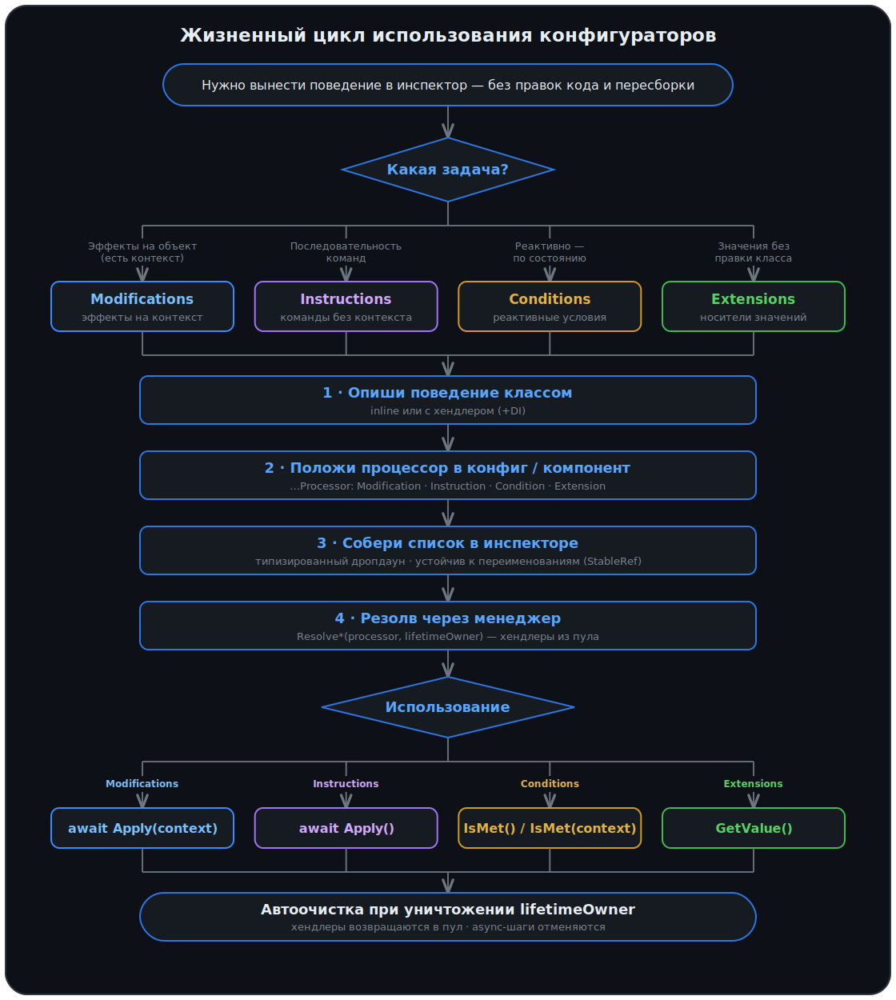

[](../../releases)
[](../../releases)
[](../../commits)
[](LICENSE.md)

[English](README.md) | **Русский**

---

**Игровые правила — как данные.** Опиши поведение один раз маленьким сериализуемым классом — а собирать, переставлять и комбинировать такие поведения будешь списком прямо в инспекторе, без единой правки кода.

В инспекторе идёт только сборка из готовых компонентов и их настройка. Configurators — это и есть реализация таких компонентов для инспектора: они складываются в типизированный список, а под капотом получают рантайм — пул хендлеров без аллокаций, зависимости через любой DI-контейнер, async-шаги с отменой по времени жизни объекта, реактивные условия.

## Содержание

<details>
<summary>Развернуть</summary>

- [Зачем](#зачем)
- [Возможности](#возможности)
- [Установка](#установка)
- [Быстрый старт](#быстрый-старт)
- [Сэмплы](#сэмплы)
- [Концепции](#концепции)
- [Инициализация](#инициализация)
  - [Создание менеджеров](#создание-менеджеров)
  - [Создание фабрики хендлеров](#создание-фабрики-хендлеров)
- [Модули](#модули)
  - [Modifications](#модуль-modifications)
  - [Instructions](#модуль-instructions)
  - [Conditions](#модуль-conditions)
  - [Extensions](#модуль-extensions)
- [Жизненный цикл использования](#жизненный-цикл-использования)
- [Инспектор](#инспектор)
- [Лайфтайм](#лайфтайм)
- [Подробнее](#подробнее)
- [Утилиты в комплекте](#утилиты-в-комплекте)

</details>

---

## Зачем

В играх постоянно добавляются мелкие поведения: эффект на юнита при спавне, шаг туториала, условие показа UI, значение-параметр на предмете. Привычные подходы — `enum` + `switch`, отдельный `MonoBehaviour` под каждое поведение или набор булевых флагов — быстро расплываются: каждое новое поведение требует правки кода и пересборки, логика размазывается по проекту, а собрать новый вариант можно только через код и пересборку.

Configurators переносит сборку правил в инспектор. Каждое поведение — отдельный маленький сериализуемый класс; в инспекторе они складываются в полиморфный список, который меняется без единой правки кода-потребителя.

**Было** — новое поведение = новый `case` и пересборка, логика в одном switch:

```csharp
public enum BuffType { MaxHealth, Speed, Shield }

public void ApplyBuff(Unit unit, BuffType type, float value)
{
    switch (type)
    {
        case BuffType.MaxHealth: unit.Health.SetMax(value); break;
        case BuffType.Speed:     unit.Movement.Speed = value; break;
        case BuffType.Shield:    unit.AddShield(value);       break;
        // ещё один бафф → правишь этот файл и пересобираешь
    }
}
```

**Стало** — новое поведение = новый класс, код-потребитель не меняется никогда:

```csharp
[Serializable, StableRefCategory("Stats")]
public class SetMaxHealth : Modification<Unit>
{
    public int Value;
    public override void Apply(Unit unit) => unit.Health.SetMax(Value);
}
```

Какие баффы применяются, в каком порядке и с какими параметрами — настраивается в инспекторе. Добавить новый тип — написать класс; собрать и настроить конкретный набор — работа в инспекторе, без кода и пересборки.

<p align="center">
  
</p>

Но сам инспектор ничего не исполняет — в нём только сборка и настройка компонентов. Логику даёт Configurators: он реализует эти компоненты и **исполняет** собранное — достаёт хендлеры из пула, инжектит в них зависимости, гоняет async-шаги по порядку и обрывает их по времени жизни объекта. А переименуешь или перенесёшь класс в другую папку — уже настроенные ассеты не осыпаются в null: ссылки на типы держит StableRef, а не хрупкое имя из `[SerializeReference]`.

---

## Возможности

- **Правила в инспекторе, без правок кода** — поведения складываются в полиморфные списки поверх `[SerializeReference]`; новое поведение = новый класс, код-потребитель неизменен.
- **Переживает переименования** — ссылки на типы держит [StableRef](https://github.com/SST-Systems/StableRef), а не имя класса. Переименовал класс или перенёс в другую папку — уже настроенные ассеты и сцены не превращаются в «missing type» и не теряют данные, как это бывает с голым `[SerializeReference]`.
- **Хендлеры пулятся** — рантайм-логика берётся из пула и возвращается в него, без аллокаций на каждый запуск.
- **Любой DI** — хендлеры получают зависимости через твой контейнер (Zenject, VContainer, …) или сервис-локатор; готовая интеграция с Zenject идёт в сэмплах.
- **Async и отмена из коробки** — шаги, которые действительно ждут (загрузка ассета, задержка, сетевой запрос), пишутся как `async` и встают в ту же цепочку, что и обычные шаги; отмена привязана к лайфтайму объекта — уничтожился объект, оборвались и запущенные шаги, без ручного отслеживания корутин.
- **Четыре модуля под разные задачи** — Modifications (эффекты на контекст), Instructions (команды без контекста), Conditions (реактивные условия с композицией), Extensions (носители значений).

---

## Установка

1. **.unitypackage** — [Releases](../../releases)
2. **UPM** — `Window → Package Manager` → `+` → `Add package from git URL`. UPM не резолвит git-зависимости автоматически — добавь все три:
   - [Pooling](https://github.com/SST-Systems/Pooling): `https://github.com/SST-Systems/Pooling.git`
   - [StableRef](https://github.com/SST-Systems/StableRef): `https://github.com/SST-Systems/StableRef.git`
   - Configurators: `https://github.com/SST-Systems/Configurators.git`

   Добавь `#тег` в конец каждого URL для фиксации версии.
3. **Вручную** — склонируй или скачай все три репозитория, скопируй в `Assets/`.

Unity 2021.3+

> Опциональная интеграция с Zenject включена как sample — импортируй через `Window → Package Manager` → выбери Configurators → вкладка **Samples**.

---

## Быстрый старт

Минимальный сквозной пример на модуле Modifications — от класса до запуска. Остальные три модуля устроены так же.

**1. Опиши поведение** — тот самый класс из [«Зачем»](#зачем):

```csharp
[Serializable, StableRefCategory("Stats")]
public class SetMaxHealth : Modification<Unit>
{
    public int Value;
    public override void Apply(Unit unit) => unit.Health.SetMax(Value);
}
```

**2. Положи `ModificationProcessor<Unit>` на компонент или конфиг и собери список в инспекторе** — типизированный дропдаун показывает все твои поведения.

**3. Зарезолви один раз и применяй к контексту:**

```csharp
public class EnemySpawner : MonoBehaviour
{
    [SerializeField] private ModificationProcessor<Unit> modifications;

    // Менеджер — создай вручную или получи из DI
    private readonly IModificationManager _manager = new ModificationManager();

    private void Awake() => _manager.ResolveModifications(modifications, lifetimeOwner: this);

    // Настроить только что созданного юнита — применяет список сверху вниз
    public async Task Configure(Unit unit) => await modifications.Apply(unit);
}
```

Новые баффы добавляются в инспекторе, порядок — перетаскиванием; класс `EnemySpawner` при этом не меняется. `lifetimeOwner: this` привязывает очистку к объекту — при его уничтожении всё освобождается автоматически.

---

## Сэмплы

Запускаемые примеры, по одному на модуль — импорт через `Window → Package Manager → Configurators → Samples`. Хочешь увидеть, как это выглядит в инспекторе и в игре — загляни в сэмплы: у каждого есть гифка и рабочий пример.

| Сэмпл | Модуль | Что показывает |
|---|---|---|
| [Instructions for Button](Samples~/Instructions%20for%20Button/README.ru.md) | Instructions | Кнопка с цепочкой инструкций на каждое событие указателя — последовательные и async-шаги, отмена. Идёт со сценой. |
| [Modifications for Object](Samples~/Modifications%20for%20Object/README.ru.md) | Modifications | Каждую секунду спавнит картинку и настраивает каждую одним списком модификаций (как контекст) — меняешь список в инспекторе, код спавнера не трогаешь. |
| [Conditions for Visibility](Samples~/Conditions%20for%20Visibility/README.ru.md) | Conditions | UI-флажки через контроллер управляют двухсостояночной панелью — комбинация условий выбирает состояние, а его инструкции меняют вид (Conditions + Instructions вместе). |
| [Extensions for Config](Samples~/Extensions%20for%20Config/README.ru.md) | Extensions | Конфиг несёт опциональные экстеншены; вьюшка рисует только присутствующие. |

Плюс [Zenject For Configurators](Samples~/Zenject%20For%20Configurators) — готовая `IHandlerFactory` и инсталлер.

---

## Концепции

| Термин | Что это |
|---|---|
| **Modification** | Единица работы, применяемая к `TContext`, выполняется последовательно. Например: «выставить max HP», «добавить тег». |
| **Instruction** | Команда без контекста — цели хранятся прямо в инспекторных полях, выполняется последовательно. Например: `GameObjectSetActive`, `PlaySound`, `WaitForSeconds`. |
| **Condition** | Булево условие с подпиской на изменения (`AddListener`) и прямой проверкой (`IsMet`). |
| **Extension** | Носитель значения, прикреплённый к конфигу или компоненту, читается по запросу. Например: кулдаун, максимальное количество, иконка. |
| **Processor** | Контейнер со списком элементов одного модуля. Лежит на конфиге или компоненте. |
| **Handler** | Пулящаяся runtime-логика для data-объекта. Нужен когда требуются внешние зависимости или инжект через DI. |
| **HandlerFactory** | Контролирует создание хендлеров. По умолчанию — `Activator.CreateInstance`. |
| **Manager** | Точка входа модуля: резолвит процессоры (создаёт и привязывает хендлеры) и владеет их лайфтаймом. Свой на каждый модуль — `IInstructionManager`, `IModificationManager` и т.д. |
| **Binding** | `IDisposable`, который возвращает `Resolve*`. Пока жив — хендлеры привязаны и процессор активен; при диспозе хендлеры уходят в пул и всё очищается. |

---

## Инициализация

### Создание менеджеров

Каждый модуль имеет свой менеджер. Создай нужные и держи их на протяжении жизни сцены или проекта:

```csharp
IInstructionManager instructionManager = new InstructionManager();
IModificationManager modificationManager = new ModificationManager();
IConditionManager conditionManager = new ConditionManager();
IExtensionManager extensionManager = new ExtensionManager();
```

Каждый компонент инжектирует только тот интерфейс, который ему нужен.

### Создание фабрики хендлеров

Хендлеры — это пулируемые runtime-объекты: создаются один раз, переиспользуются и возвращаются в пул при диспозе. Из-за этого их нельзя создавать через стандартный DI-контейнер напрямую: контейнер не знает, когда их создавать и сколько экземпляров нужно. Фабрика решает эту проблему — она единственное место, которое знает как сконструировать хендлер, и может делегировать это DI-контейнеру, чтобы тот автоматически проинжектировал все зависимости.

Менеджеры делегируют создание хендлеров в `IHandlerFactory`. **По умолчанию — `ActivatorHandlerFactory`** — создаёт их через `Activator.CreateInstance`. Работает, когда у хендлеров нет зависимостей (или они берут их вручную через сервис-локатор). Для старта этого достаточно.

Если хендлерам нужен DI — подключи свою фабрику, чтобы созданием занимался контейнер. Готовая интеграция с Zenject (фабрика + инсталлер с биндингами) лежит в сэмпле [Zenject For Configurators](Samples~/Zenject%20For%20Configurators).

<details>
<summary><b>Своя фабрика под DI</b></summary>

Менеджеры берут хендлеры из `IHandlerFactory`:

```csharp
public interface IHandlerFactory
{
    object Create(Type handlerType);
}
```

Реализуй интерфейс так, чтобы экземпляр создавал DI-контейнер:

```csharp
public class ZenjectHandlerFactory : IHandlerFactory
{
    [Inject] private readonly IInstantiator _instantiator;

    public object Create(Type handlerType) => _instantiator.Instantiate(handlerType);
}
```

После этого любой хендлер может объявить собственные поля с `[Inject]` и получать зависимости как любой другой класс — фабрика возьмёт это на себя. Как забиндить фабрику и менеджеры — смотри инсталлер в сэмпле [Zenject For Configurators](Samples~/Zenject%20For%20Configurators).

</details>

---

## Модули

Основная единица хранения конфигураторов — **Processor**. В нём хранится и настраивается список элементов прямо в инспекторе. Для каждого модуля есть свой тип процессора (`ModificationProcessor<T>`, `InstructionProcessor`, `ConditionProcessor`, `ExtensionProcessor`) — добавь нужный на конфиг или компонент.

После объявления процессор необходимо зарезолвить через менеджер — это привязывает хендлеры к data-объектам и подготавливает runtime. Лайфтайм контролируется через `lifetimeOwner` (авто-диспоз при уничтожении объекта) или вручную через возвращённый `IDisposable`.

```csharp
// 1. Создай менеджер один раз (лайфтайм сцены/проекта)
IModificationManager manager = new ModificationManager();

// 2. Резолв перед использованием — привязывает хендлеры
manager.ResolveModifications(processor, lifetimeOwner: this);

// 3. Запуск после резолва — Apply возвращает Task; await, если нужно дождаться async-шагов
await processor.Apply(context);
```

> **О примерах.** Примеры кода ниже не используют DI-контейнер. `ServiceLocator.Get<T>()` — условное обозначение: как именно ты получаешь менеджеры (ручное создание, Zenject, VContainer или любой другой подход) — полностью на твоё усмотрение. `Unit`, `PlayerHealth`, `IGameFactory`, `ISkinService` и аналогичные типы — проектные плейсхолдеры; подставь свои.

### Модуль Modifications

Модификации применяют эффекты к контексту — объекту, сущности, любым данным. Например: настроить характеристики юнита при спавне, применить эффект предмета к игроку, изменить параметры уровня. Вся логика описывается в инспекторе без изменений кода. Модификации выполняются **последовательно**; шаг может быть синхронным или, когда нужно дождаться чего-то (загрузка ассета, получение значения), асинхронным — следующий стартует только после завершения текущего.

Один и тот же список применяется и к одному объекту, и к каждому из сотни заспавненных: правила настроил один раз — применяешь к любому их количеству.

Самый простой вариант — inline-модификация с синхронным `Apply`:

```csharp
[Serializable]
[StableRefCategory("Stats")]
public class SetMaxHealth : Modification<Unit>
{
    public int Value;

    public override void Apply(Unit context) => context.Health.SetMax(Value);
}
```

<details>
<summary><b>Все варианты: inline / с хендлером × sync / async</b></summary>

Выбор по двум осям: **inline vs с хендлером** (нужны инжектируемые зависимости?) и **sync vs async** (нужно `await`?). Sync — по умолчанию и легче всего в написании; async бери только когда шаг реально ждёт.

- **Inline** — логика прямо на data-классе. Sync-база `Modification<TContext>` (`void Apply`), async-база `AsyncModification<TContext>` (`Task Apply`).
- **С хендлером** — данные и логика разделены; хендлер создаётся фабрикой и пулится. Sync-пара `ModificationData` + `ModificationHandler`, async-пара `AsyncModificationData` + `AsyncModificationHandler`.

Процессор выполняет список по порядку — синхронные записи сразу, асинхронные через `await`. Если все записи синхронные, весь запуск завершается синхронно.

##### Inline — async

```csharp
[Serializable]
[StableRefCategory("Time")]
public class RevealAfterDelay : AsyncModification<Unit>
{
    public float Seconds;

    public override async Task Apply(Unit context, CancellationToken cancellationToken = default)
    {
        await Task.Delay(TimeSpan.FromSeconds(Seconds), cancellationToken);
        context.SetVisible(true);
    }
}
```

##### С хендлером — sync (DI, без await)

```csharp
[Serializable]
[StableRefCategory("Spawn")]
public class SpawnChild : ModificationData<Unit, SpawnChildHandler>
{
    public Unit Prefab;
}

public class SpawnChildHandler : ModificationHandler<SpawnChild, Unit>
{
    private readonly IGameFactory _factory = ServiceLocator.Get<IGameFactory>();
    // С Zenject: [Inject] private readonly IGameFactory _factory;

    public override void Apply(Unit context) => _factory.Spawn(Data.Prefab, context.transform.position);
}
```

##### С хендлером — async (DI + await)

```csharp
[Serializable]
[StableRefCategory("Appearance")]
public class ApplySkin : AsyncModificationData<Unit, ApplySkinHandler>
{
    public string SkinId;
}

public class ApplySkinHandler : AsyncModificationHandler<ApplySkin, Unit>
{
    private readonly ISkinService _skins = ServiceLocator.Get<ISkinService>();
    // С Zenject: [Inject] private readonly ISkinService _skins;

    public override async Task Apply(Unit context, CancellationToken cancellationToken = default)
    {
        var skin = await _skins.LoadAsync(Data.SkinId, cancellationToken);
        context.SetSkin(skin);
    }
}
```

</details>

**Запуск:**

```csharp
public class EnemySpawner : MonoBehaviour
{
    [SerializeField] private ModificationProcessor<Unit> modifications;

    private readonly IModificationManager _modificationManager = ServiceLocator.Get<IModificationManager>();
    // С Zenject: [Inject] private readonly IModificationManager _modificationManager;

    private void Awake()
    {
        // Резолв один раз — хендлеры привязаны, цепочка отменится при уничтожении объекта
        _modificationManager.ResolveModifications(modifications, lifetimeOwner: this);
    }

    // Сконфигурировать только что заспавненного юнита — ждём каждую модификацию по порядку
    public async Task Configure(Unit unit)
    {
        try { await modifications.Apply(unit); }
        catch (OperationCanceledException) { /* юнит или спавнер уничтожен во время конфигурации */ }
    }
}
```

<details>
<summary><b>Нюансы: отмена, конкурентность, ручной лайфтайм, повторный резолв</b></summary>

> **Рекомендация.** По умолчанию бери sync (`Modification` / `ModificationData`); переключайся на async-варианты только когда шаг действительно ждёт.

> **Отмена.** Диспоз биндинга или уничтожение `lifetimeOwner` отменяет выполняющиеся async-запуски. Можно также передать свой токен в `Apply`. Прокидывай токен во все `await` внутри async-модификаций (и вызывай `cancellationToken.ThrowIfCancellationRequested()` в циклах), иначе текущий шаг доработает до конца прежде чем остановится.

> **Конкурентность.** Процессор не хранит состояние запуска, поэтому один процессор можно применять сразу к нескольким объектам — например `await Task.WhenAll(units.Select(u => modifications.Apply(u)))`. Цепочка каждого контекста выполняется независимо (и по порядку внутри себя). Безопасно, пока хендлеры не хранят per-call состояние в полях — контекст приходит параметром, а не сохраняется.

Ручной контроль (`lifetimeOwner: null`):

```csharp
private IDisposable _binding;

private void Setup(ModificationProcessor<SomeContext> processor)
{
    _binding = _modificationManager.ResolveModifications(processor, lifetimeOwner: null);
}

private void Cleanup()
{
    _binding?.Dispose(); // хендлеры возвращаются в пул
}
```

**Повторный резолв** — вызов `ResolveModifications` на уже резолвнутом процессоре автоматически диспозит предыдущий биндинг и создаёт новый. Используй чтобы передать контроль новому `lifetimeOwner`:

```csharp
_modificationManager.ResolveModifications(processor, lifetimeOwner: newOwner);
```

</details>

**Рабочий пример:** [Modifications for Object](Samples~/Modifications%20for%20Object/README.ru.md)

---

### Модуль Instructions

Инструкции — команды без контекста. Цели хранятся прямо в инспекторных полях data-класса. Инструкции выполняются последовательно: каждая следующая стартует только после завершения предыдущей. Шаг может быть синхронным или асинхронным (задержки, ожидания, отмена). Типичные примеры: последовательность событий на уровне, анимационные цепочки, туториальные шаги, задержки между действиями.

Раньше такую последовательность — «показать подсказку → подождать 2 сек → подсветить кнопку → дождаться клика» — собирали корутиной или ручным стейт-машином, и каждое изменение означало правку кода и пересборку. Здесь это список в инспекторе: шаги перетаскиваются мышкой, ждущие пишутся как `async`, а при уничтожении объекта вся цепочка обрывается сама.

Самый простой вариант — inline-инструкция с синхронным `Apply`:

```csharp
[Serializable]
[StableRefCategory("GameObject")]
public class GameObjectSetActive : Instruction
{
    public GameObject Object;
    public bool Value;

    public override void Apply() => Object.SetActive(Value);
}
```

<details>
<summary><b>Все варианты: inline / с хендлером × sync / async</b></summary>

Выбор по двум осям: **inline vs с хендлером** (нужны инжектируемые зависимости?) и **sync vs async** (нужно `await`?). Sync — по умолчанию.

- **Inline** — логика на data-классе. Sync-база `Instruction` (`void Apply()`), async-база `AsyncInstruction` (`Task Apply(ct)`).
- **С хендлером** — данные и логика разделены; хендлер создаётся фабрикой и пулится. Sync-пара `InstructionData` + `InstructionHandler`, async-пара `AsyncInstructionData` + `AsyncInstructionHandler`.

##### Inline — async

```csharp
// Задержка — токен передаётся в Task.Delay, отмена работает сразу
[Serializable]
[StableRefCategory("Time")]
public class WaitForSeconds : AsyncInstruction
{
    public float Duration;

    public override async Task Apply(CancellationToken cancellationToken = default)
    {
        await Task.Delay(TimeSpan.FromSeconds(Duration), cancellationToken);
    }
}

// Цикл с проверкой отмены на каждой итерации
[Serializable]
[StableRefCategory("Movement")]
public class MoveToTarget : AsyncInstruction
{
    public Transform Object;
    public Transform Target;
    public float Speed = 5f;

    public override async Task Apply(CancellationToken cancellationToken = default)
    {
        while (Vector3.Distance(Object.position, Target.position) > 0.01f)
        {
            cancellationToken.ThrowIfCancellationRequested();

            Object.position = Vector3.MoveTowards(Object.position, Target.position, Speed * Time.deltaTime);
            await Task.Yield();
        }
    }
}
```

##### С хендлером — sync (DI, без await)

```csharp
[Serializable]
[StableRefCategory("Audio")]
public class SetMasterVolume : InstructionData<SetMasterVolumeHandler>
{
    [Range(0, 1)] public float Volume = 1f;
}

public class SetMasterVolumeHandler : InstructionHandler<SetMasterVolume>
{
    private readonly IAudioService _audioService = ServiceLocator.Get<IAudioService>();
    // С Zenject: [Inject] private readonly IAudioService _audioService;

    public override void Apply() => _audioService.SetMasterVolume(Data.Volume);
}
```

##### С хендлером — async (DI + await)

```csharp
[Serializable]
[StableRefCategory("Audio")]
public class PlaySound : AsyncInstructionData<PlaySoundHandler>
{
    public AudioClip Clip;
    [Range(0, 1)] public float Volume = 1f;
}

public class PlaySoundHandler : AsyncInstructionHandler<PlaySound>
{
    private readonly IAudioService _audioService = ServiceLocator.Get<IAudioService>();
    // С Zenject: [Inject] private readonly IAudioService _audioService;

    public override async Task Apply(CancellationToken cancellationToken = default)
    {
        await _audioService.PlayAndWait(Data.Clip, Data.Volume, cancellationToken);
    }
}
```

</details>

**Запуск:**

```csharp
public class TutorialController : MonoBehaviour
{
    [SerializeField] private InstructionProcessor steps;

    private readonly IInstructionManager _instructionManager = ServiceLocator.Get<IInstructionManager>();
    // С Zenject: [Inject] private readonly IInstructionManager _instructionManager;

    private void Awake()
    {
        // Резолв один раз — хендлеры привязаны, цепочка отменится при уничтожении объекта
        _instructionManager.ResolveInstructions(steps, lifetimeOwner: this);
    }

    // Запустить цепочку — повторный вызов автоматически отменяет предыдущий запуск
    public void StartTutorial()
    {
        steps.Apply();
    }

    // Запустить и дождаться завершения всей цепочки
    public async Task StartAndAwait()
    {
        steps.Apply();

        try
        {
            await steps.ExecutionTask;
            Debug.Log("Все инструкции выполнены");
        }
        catch (OperationCanceledException)
        {
            Debug.Log("Цепочка прервана");
        }
    }

    // Досрочная отмена без перезапуска
    public void StopTutorial() => steps.Cancel();
}
```

<details>
<summary><b>Дополнительные методы и нюансы</b></summary>

> **Рекомендация.** По умолчанию бери sync (`Instruction` / `InstructionData`); async-варианты — когда шаг реально ждёт.

> **Отмена.** При диспозе биндинга или уничтожении `lifetimeOwner` текущая цепочка отменяется; повторный `Apply` отменяет предыдущий запуск. В своих async-инструкциях прокидывай токен во все `await` (`Task.Delay(ms, cancellationToken)`, `UniTask.Delay(...)` и т.д.) и вызывай `cancellationToken.ThrowIfCancellationRequested()` в циклах — иначе текущий шаг доработает до конца прежде чем остановится.

**`processor.ExecutionTask`** — таска текущего выполнения. Awaить снаружи чтобы дождаться завершения всей цепочки. При отмене завершается с `OperationCanceledException`.

**`processor.Cancel()`** — отменяет текущую выполняющуюся цепочку без перезапуска.

**Повторный резолв** — вызов `ResolveInstructions` на уже резолвнутом процессоре диспозит предыдущий биндинг и передаёт контроль новому `lifetimeOwner`:

```csharp
_instructionManager.ResolveInstructions(processor, lifetimeOwner: newOwner);
```

</details>

**Рабочий пример:** [Instructions for Button](Samples~/Instructions%20for%20Button/README.ru.md)

---

### Модуль Conditions

Условия — булевы предикаты с подпиской на изменения. Решают задачу реактивного отображения и поведения: показать/скрыть UI, активировать/деактивировать объект, включить/выключить механику — в зависимости от состояния игры. Условия комбинируются через `All`, `Any`, `None`, `Not`.

Подпишись на процессор один раз — и колбэк дёргается сам при каждом изменении: не нужно вручную разводить события от здоровья, инвентаря и таймера по всем подписчикам. А дерево `All`/`Any`/`Not`, собранное в инспекторе, нотифицирует как одно условие.

Самый простой вариант — inline-условие, которое опрашивается напрямую через `IsMet()`:

```csharp
[Serializable]
[StableRefCategory("Time")]
public class IsNight : Condition
{
    public override bool IsMet() => DayCycle.Current == TimeOfDay.Night;
}
```

<details>
<summary><b>С хендлером — реактивная подписка на изменения</b></summary>

**С хендлером** обязателен когда нужна **реактивная подписка на изменения**. Хендлер предоставляет lifecycle-хуки `OnFirstListenerAdded` / `OnLastListenerRemoved`: первый вызывается когда появляется первый подписчик, второй — когда уходит последний. Внутри хуков подписывайся на события источника данных и вызывай `NotifyChanged()` при изменении. Без хендлера изменения не будут нотифицироваться — только прямой опрос.

```csharp
// Данные — лежат в конфиге, сериализуются
[Serializable]
[StableRefCategory("Health")]
public class HealthBelow : ConditionData<HealthBelowHandler>
{
    [Range(0, 1)] public float Threshold;
}

// Хендлер — с подпиской на изменения
public class HealthBelowHandler : ConditionHandler<HealthBelow>
{
    private readonly PlayerHealth _health = ServiceLocator.Get<PlayerHealth>();
    // С Zenject: [Inject] private readonly PlayerHealth _health;

    // Вызывается когда появляется первый подписчик — подписываемся на источник
    protected override void OnFirstListenerAdded()
    {
        _health.OnChanged += NotifyChanged;
    }

    // Вызывается когда уходит последний подписчик — освобождаем подписку
    protected override void OnLastListenerRemoved()
    {
        _health.OnChanged -= NotifyChanged;
    }

    public override bool IsMet() => _health.Ratio < Data.Threshold;
}
```

`NotifyChanged()` — метод базового класса. Вызывай его когда состояние условия изменилось, чтобы все подписчики получили уведомление.

> **Рекомендация.** Если условие должно реагировать на события (изменение здоровья, смена состояния, таймер) — всегда используй хендлер. Inline подходит только для условий, которые опрашиваются вручную.

</details>

**Запуск** — резолв один раз, затем подписка; колбэк вызывается сразу с текущим состоянием и далее при каждом изменении:

```csharp
public class UIHealthWarning : MonoBehaviour
{
    [SerializeField] private ConditionProcessor conditions;

    private readonly IConditionManager _conditionManager = ServiceLocator.Get<IConditionManager>();
    // С Zenject: [Inject] private readonly IConditionManager _conditionManager;

    private void Awake()
    {
        // Резолв один раз — хендлеры привязаны, диспоз при уничтожении объекта
        _conditionManager.ResolveConditions(conditions, lifetimeOwner: this);

        // Подписка напрямую на процессоре
        conditions.Subscribe(isMet => gameObject.SetActive(isMet));
    }
}
```

<details>
<summary><b>Дополнительные методы и композитные условия</b></summary>

Прямая проверка без подписки:

```csharp
if (_conditions.IsMet())
{
    // выполнить действие
}
```

**`processor.Subscribe(Action<bool> onChanged)`** — регистрирует колбэк, который вызывается сразу с текущим результатом `IsMet()`, а затем при каждом изменении любого условия. Поддерживается несколько подписчиков одновременно.

**`processor.Unsubscribe(Action<bool> onChanged)`** — удаляет конкретный колбэк. Слушатели условий снимаются автоматически когда отписывается последний подписчик.

**`processor.UnsubscribeAll()`** — удаляет всех подписчиков и слушателей разом. Используется менеджером при диспозе биндинга.

**`processor.IsMet()`** — прямая проверка всех условий без подписки. Возвращает `true` если список пуст. Все условия должны быть выполнены (аналог `All`).

**Повторный резолв** — вызов `ResolveConditions` на уже резолвнутом процессоре диспозит предыдущий биндинг (отвязывает хендлеры и вызывает `processor.UnsubscribeAll()`) и передаёт контроль новому `lifetimeOwner`:

```csharp
_conditionManager.ResolveConditions(processor, lifetimeOwner: newOwner);
```

**Композитные условия** — `All`, `Any`, `None`, `Not` комбинируют условия и вкладываются друг в друга:

```
All
├── HealthBelow (0.5)
├── IsNight
└── Not
    └── HasItem (key)
```

Добавляются в инспекторе как обычные условия. Слушатели на композите срабатывают один раз на каждое изменение внутри, независимо от количества внешних подписчиков.

</details>

**Рабочий пример:** [Conditions for Visibility](Samples~/Conditions%20for%20Visibility/README.ru.md)

---

### Модуль Extensions

Экстеншены — носители значений. Позволяют добавлять произвольные значения (кулдаун, максимальное количество, радиус, иконку, префаб) к любому конфигу или компоненту без изменения его класса. Значения можно задать прямо в инспекторе или получать в рантайме через хендлер (загрузить спрайт из asset-менеджера по id, найти значение в БД, или просто получить в рантайме из менеджера).

Не нужно раздувать конфиг десятком опциональных полей «на всякий случай» — иконка, которая есть не у всех, кулдаун, нужный паре предметов. Навесил экстеншен там, где он реально нужен, — вьюшка читает только присутствующие и про остальные ничего не знает.

Самый простой вариант — inline-экстеншен с синхронным `GetValue`:

```csharp
[Serializable]
[StableRefCategory("Limits")]
public class MaxCount : Extension<int>
{
    [SerializeField] private int value;

    public override int GetValue() => value;
}
```

Читается напрямую (поддерживается неявное приведение к `T`):

```csharp
int max = item.Extensions.TryGetExtension(out MaxCount ext) ? ext : int.MaxValue;
```

<details>
<summary><b>Все варианты: inline / с хендлером × sync / async</b></summary>

Выбор по двум осям: **inline vs с хендлером** (нужны инжектируемые зависимости?) и **sync vs async** (значение готово сразу или загружается?). Читаешь через `GetValue()` (sync) или `await GetValueAsync(ct)` (async) на том экстеншене, что достал.

- **Inline** — значение прямо на data-классе. Sync-база `Extension<T>` (`T GetValue()`), async-база `AsyncExtension<T>` (`Task<T> GetValueAsync(ct)`).
- **С хендлером** — данные и логика разделены; хендлер создаётся фабрикой и пулится. Sync-пара `ExtensionData` + `ExtensionHandler`, async-пара `AsyncExtensionData` + `AsyncExtensionHandler`.

Async-экстеншены (inline или с хендлером) нужно зарезолвить через `IExtensionManager` перед запросом значения.

##### Inline — async

```csharp
[Serializable]
[StableRefCategory("Remote")]
public class RemoteFlag : AsyncExtension<bool>
{
    public string Key;

    public override async Task<bool> GetValueAsync(CancellationToken cancellationToken = default)
        => await RemoteConfig.GetBoolAsync(Key, cancellationToken);
}
```

##### С хендлером — sync (DI, без await)

```csharp
[Serializable]
[StableRefCategory("Assets")]
public class IconById : ExtensionData<Sprite, IconByIdHandler>
{
    public string Id;
}

public class IconByIdHandler : ExtensionHandler<IconById, Sprite>
{
    private readonly IIconRegistry _icons = ServiceLocator.Get<IIconRegistry>();
    // С Zenject: [Inject] private readonly IIconRegistry _icons;

    public override Sprite GetValue() => _icons.Find(Data.Id);
}
```

##### С хендлером — async (DI + await)

```csharp
[Serializable]
[StableRefCategory("Assets")]
public class SpriteById : AsyncExtensionData<Sprite, SpriteByIdHandler>
{
    public string Id;
}

public class SpriteByIdHandler : AsyncExtensionHandler<SpriteById, Sprite>
{
    private readonly IAssetManager _assets = ServiceLocator.Get<IAssetManager>();
    // С Zenject: [Inject] private readonly IAssetManager _assets;

    public override async Task<Sprite> GetValueAsync(CancellationToken cancellationToken = default)
        => await _assets.LoadSpriteAsync(Data.Id, cancellationToken);
}
```

</details>

**Запуск с хендлером** — зарезолвить один раз, затем awaить значение по запросу. Свой токен линкуется с resolve-токеном:

```csharp
_extensionManager.ResolveExtensions(extensions, lifetimeOwner: this);

if (extensions.TryGetExtension(out SpriteById icon))
    image.sprite = await icon.GetValueAsync(cancellationToken);
```

<details>
<summary><b>Дополнительные методы и нюансы</b></summary>

> **Отмена.** Диспоз биндинга или уничтожение `lifetimeOwner` отменяет незавершённый `GetValueAsync` — `await` бросит `OperationCanceledException`. Прокидывай токен во все `await` внутри хендлера, иначе загрузка доработает до конца прежде чем остановится.

> **Конкурентность.** У каждого экстеншена свой экземпляр хендлера, поэтому вызывать `GetValueAsync` у разных экстеншенов одновременно безопасно. Вызов у *одного* экстеншена запускает по загрузке на каждый вызов — дедупликации и кэша нет — и безопасен только если хендлер не хранит per-call состояние в полях. Закешируй `Task<TValue>` внутри хендлера, если хочешь одну загрузку на всех. В Unity `await` обычно продолжается на главном потоке, так что это кооперативное чередование, а не настоящий параллелизм.

**`GetValueAsync(ct)`** — есть у async-экстеншенов (`AsyncExtension<T>` и `AsyncExtensionData`). Для хендлерных требует предварительного `ResolveExtensions`; до байнда логирует ошибку и возвращает `default`. Диспоз биндинга отменяет незавершённый запрос (токен сработает, только если хендлер прокидывает его в свои `await`). Синхронные экстеншены читаются через `GetValue()`.

**`GetExtensions<T>()`** — перечисляет все экстеншены указанного типа:

```csharp
foreach (var tag in config.Extensions.GetExtensions<Tag>())
    Debug.Log(tag.GetValue());
```

> **Примечание.** `TryGetExtension` возвращает первый найденный и логирует warning если их несколько — используй `GetExtensions<T>` чтобы перечислить все.

</details>

**Рабочий пример:** [Extensions for Config](Samples~/Extensions%20for%20Config/README.ru.md)

---

## Жизненный цикл использования

Как конфигуратор проходит путь от выбора модуля до автоочистки. Сначала по задаче выбираешь модуль, дальше шаги одинаковы для всех четырёх: описал поведение классом → положил процессор → собрал список в инспекторе → зарезолвил через менеджер → используешь → всё само освобождается при уничтожении владельца.

<p align="center">
  
</p>

---

## Инспектор

Встроенные процессоры (`ModificationProcessor<T>`, `InstructionProcessor`, `ConditionProcessor`, `ExtensionProcessor`) уже отдают типизированный дропдаун — кладёшь процессор в конфиг / компонент и он сразу работает.

Чтобы сгруппировать свои типы под подменю в дропдауне, навесь `[StableRefCategory("Path/Submenu")]`:

```csharp
[Serializable]
[StableRefCategory("Inventory/Item")]
public class MaxCount : Extension<int> { ... }
```

Если нужен полиморфный список вне встроенных процессоров — используй `StableRefList<T>` напрямую, это тот же тип что используют процессоры внутри.

---

## Лайфтайм

Каждый `Resolve*` внутри менеджера **резолвит хендлеры** (берёт из пула или создаёт через фабрику, привязывает к data-объектам) и **возвращает `IDisposable`** — биндинг, при диспозе которого хендлеры возвращаются в пул и всё очищается.

Параметр `lifetimeOwner` обязателен. Передай объект-владелец — и менеджер задиспозит биндинг автоматически при его уничтожении. Если контролируешь диспоз сам — передай `null` явно:

```csharp
// Авто-диспоз при уничтожении объекта — IDisposable хранить не нужно
_manager.ResolveInstructions(processor, lifetimeOwner: this);

// Ручной контроль — null явно, IDisposable держишь и диспозишь сам
_binding = _manager.ResolveInstructions(processor, lifetimeOwner: null);

// Комбинированный — авто-диспоз при уничтожении И досрочный ручной диспоз при необходимости
_binding = _manager.ResolveInstructions(processor, lifetimeOwner: this);
// ...
_binding.Dispose(); // безопасно вызвать досрочно; no-op если уже задиспожен через lifetimeOwner
```

Правила:

- Повторный вызов любого `Resolve*` на том же процессоре **автоматически диспозит предыдущий биндинг** — следить за этим не нужно.
- `Dispose()` **идемпотентен** — безопасно вызывать несколько раз или в любом порядке. Исключения при очистке логируются, не пробрасываются.
- Вызов `Apply()`, `IsMet()` или методов подписки на `*Data`-объекте **вне активного биндинга** (до резолва или после диспоза) — no-op: методы возвращают `false` или ничего не делают.

---

## Подробнее

- **[Хуки жизненного цикла биндинга](Documentation~/ADVANCED.ru.md#хуки-жизненного-цикла-биндинга)** — `IBindingLifecycle`: resolve-scoped подписки и состояние, гарантии парности.
- **[Под капотом](Documentation~/ADVANCED.ru.md#под-капотом)** — пул хендлеров, реестр активных биндингов, LIFO-очистка, `ProcessorReleaser`, полный жизненный цикл и цепочка диспоза.

---

## Утилиты в комплекте

**[StableRef](https://github.com/SST-Systems/StableRef)** — сериализуемая обёртка для полиморфных ссылок поверх `[SerializeReference]`. Выживает при переименовании классов. Редакторные инструменты: поиск по типу, find-usages, отчёт о сломанных ссылках.

**[Pooling](https://github.com/SST-Systems/Pooling)** — лёгкий generic-пул (`Pool<T>`, `MultiPool<TKey, TValue>`). Используется менеджерами для пулинга хендлеров. Нет зависимостей от Unity.

---

## Лицензия

Распространяется под [MIT License](LICENSE.md). Свободно для использования в личных и коммерческих проектах.

Автор — **Egor Shesterikov**.
