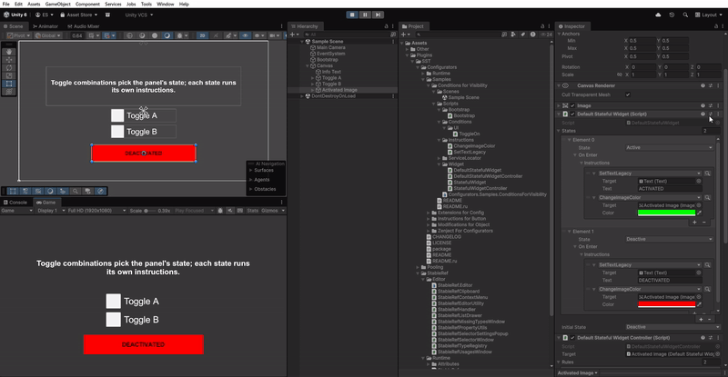

# Conditions for Visibility

**English** | [Русский](README.ru.md)

This sample is about **conditions** — boolean checks that also tell you the *moment* their answer changes. Instead
of asking "is it true yet?" every frame, you subscribe once and react only when something actually flips.

Here the conditions are UI toggles. A small controller holds a list of rules like *"be Active when toggle A **and**
toggle B are on"*. Whenever any toggle flips, the controller re-checks the rules top to bottom, the first one whose
combination is currently true wins, and it tells the widget which state to show. The panel switches between
**Active** and **Deactive**, and each state runs its own instructions to restyle it (image colour, label text).

The point is the separation of concerns: the widget is a plain state machine that knows nothing about conditions,
and the controller is the single place where the *"when"* lives. Swap the toggles for any other conditions — a
timer, player stats, a network flag — and neither the widget nor its visuals have to change.

## Preview

  

## What's inside

- `StatefulWidget<TState>` — plain state machine: each state maps to an `InstructionProcessor` played on entry; switch with `SetState`, pick a default with `initialState`. No conditions.
- `DefaultStatefulWidget` / `DefaultState` — a ready-made two-state widget (`Active` / `Deactive`).
- `StatefulWidgetController<TState>` — the optional add-on: rules of `ConditionProcessor` → state; the first met rule wins and calls the widget's `SetState`. The only place conditions live.
- `DefaultStatefulWidgetController` — a concrete controller for the two-state widget.
- `ToggleOn` — a reactive, handler-based condition driven by a UI `Toggle`; combine several with `All`/`Any`/`Not`.
- Instructions: `ChangeImageColor`, `SetTextLegacy` (both sync) — restyle the panel and its label on state enter.
- `Bootstrap` registers the `InstructionManager` (for the widget) and the `ConditionManager` (for the controller).

## Run it

Open `Scenes/Sample Scene.unity`, press Play, and flip the toggles. When a rule's toggle combination becomes true
the panel switches state and its instructions restyle it. Everything is authored in the Inspector — edit the rules
on the controller, or the states and `initialState` on the widget, to change the behaviour.

> The widget knows nothing about conditions — you can also drive it straight from code or a `UnityEvent`. An empty
> condition set is always met, so it makes a handy fallback rule; place it last.
