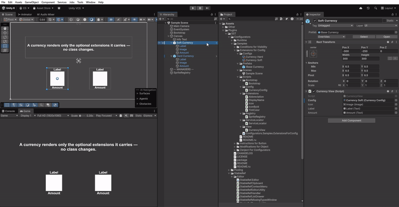

# Extensions for Config

**English** | [Русский](README.ru.md)

This sample is about **extensions** — optional values you bolt onto a config *without touching its class*. The base
config stays tiny; anything extra (an icon, a display name, a colour) is added as a separate extension in the
Inspector, only where you actually need it.

Here a currency is just an `id` and an `amount`. One currency also carries an icon, a name and a colour; another
carries nothing extra at all. The view asks each config "do you have a name? an icon? a colour?" and draws only
what's actually there. So you can make some currencies rich and leave others bare — and when you invent a brand-new
facet later, you add an extension type, not a field on `CurrencyConfig` or a branch in the view.

## Preview

  

## What's inside

- `CurrencyConfig` (ScriptableObject) — just `id`/`amount`, plus an `ExtensionProcessor` that carries the optional facets.
- Extensions: `DisplayName`, `Abbreviation`, `TintColor`, `Icon` (inline sync) and `IconById` (async handler,
  pulls a sprite from `SpriteRegistry`).
- `CurrencyView` — reads `TryGetExtension<T>` and reflects only the extensions that are present.
- `SpriteRegistry` — a stand-in asset manager; `Bootstrap` registers the `ExtensionManager`.

## Run it

Open `Scenes/Sample Scene.unity` and press Play. One currency row shows its icon, name and colour; the other shows
just its amount — same `CurrencyView` component, driven only by which extensions each config carries. Open the
currency assets in the Inspector and add or remove extensions to watch a row change, without editing any code.

> `TryGetExtension` returns the first match; use `GetExtensions<T>` for several values of one type. Resolve a
> given config in a single view (a repeat `ResolveExtensions` disposes the previous binding).
