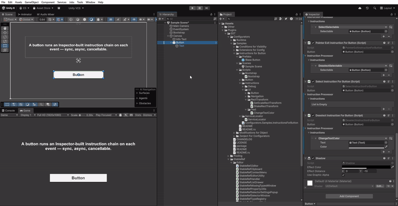

# Instructions for Button

**English** | [Русский](README.ru.md)

This sample is about **instructions** — small, self-contained actions (scale something, shake it, recolour text,
log a message) that you stack into a list right in the Inspector, no code required.

Here a UI button owns one such list per event — click, hover in/out, press/release, select/deselect. When an event
fires, the button just plays its list top to bottom. Steps can be instant or run over time (async), and a later
step can even cancel one that's still running. Want different feedback on hover than on click? Reorder or swap the
steps in the Inspector — the button script itself never changes.

## Preview

  

## What's inside

- `InstructionForButtonBase` / `PressInstructionForButtonBase` — components that bind an `InstructionProcessor`
  to `Button` events and resolve it through the manager.
- Per-event components: `Click`, `PointerEnter`/`PointerExit`, `PointerDown`/`PointerUp`, `Select`/`Deselect`.
- Instructions: `LogMessage`, `SelectSelectable`/`DeselectSelectable`, `SetScaleRectTransform`/`ShakeRectTransform`
  (async), `ChangeTextColor`, `CancelInstructionForButton`.
- `Bootstrap` registers the `InstructionManager`; `ServiceLocator` is a tiny registry.
- Ready-made scene — `Scenes/Sample Scene.unity`.

## Run it

Open `Scenes/Sample Scene.unity` and press Play. Hover/click the button — each event runs its own chain. The
instruction lists and their order are configured in the Inspector on the button's components.

> Requires the **Input System** package (the asmdef references `Unity.InputSystem`).
