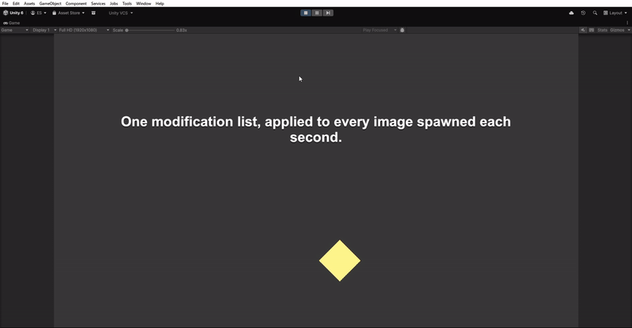

# Modifications for Object

[English](README.md) | **Русский**

Этот пример про **модификации (modifications)** — одноразовые эффекты, которые настраивают целевой объект (его
*контекст*). Идея: описать *как* объект должен быть настроен, в виде переставляемого списка в инспекторе, а затем
применять этот же список к любому нужному объекту.

Здесь спавнер каждую секунду создаёт на канвасе новую 2D-картинку и прогоняет по ней один список модификаций —
вырастить (GrowIn), задать цвет, добавить случайный оттенок, повернуть. Каждая картинка проходит через один и тот
же список, поэтому поменять вид *всех* будущих — это просто редактирование этого списка: добавить, убрать,
переставить шаги. Код спавнера, который их создаёт, при этом не меняется.

## Превью

  

## Что внутри

- `Shape` — контекст (обёртка над UI-`Image`), который настраивают модификации.
- `ShapeSpawner` — каждую секунду спавнит картинку под `RectTransform` и делает по ней `await modificationProcessor.Apply(shape)`.
- Модификации: `SetColor`, `SetName`, `SetRotation` (inline sync), `GrowIn` (inline async),
  `RandomTint` (handler — данные+логика раздельно).
- `Bootstrap` регистрирует `ModificationManager`; `ServiceLocator` — простой реестр.

## Запуск

Открой `Scenes/Sample Scene.unity` и нажми Play. Новая фигура спавнится автоматически раз в секунду, и каждая
настраивается одним и тем же списком модификаций. Выдели `ShapeSpawner` в инспекторе и переставь или подкрути список
(или интервал спавна) — каждый следующий спавн поменяется вместе с ним, без правок кода.

> Один процессор можно применять к множеству контекстов. Меняя список в инспекторе, ты меняешь конфигурацию
> всех будущих спавнов без правок к